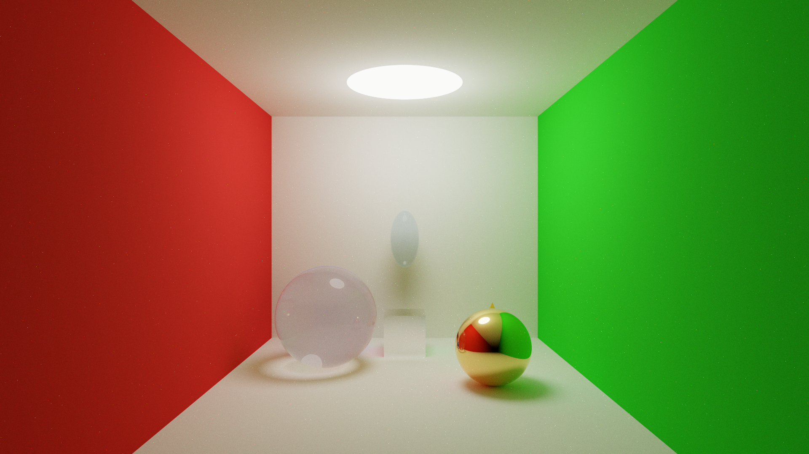

# PathTracer

**A GPU-accelerated physically-based path tracer built with Rust and WebGPU.**

Render photorealistic 3D scenes with geometric primitives, fractals, and OBJ models -- all in real time on your GPU.



## Features

- **GPU-accelerated path tracing** -- wgpu compute shaders running on Vulkan, Metal, or DX12
- **17 geometric shape types** -- Sphere, Plane, Cube, Cylinder, Cone, Torus, Disc, Triangle, Ellipsoid, Paraboloid, Hyperboloid, Pyramid, Tetrahedron, Mebius strip, Mandelbulb, Julia set, Skybox
- **OBJ model loading** -- import Wavefront `.obj` meshes with automatic triangulation
- **Physically-based rendering** -- Cook-Torrance/GGX microfacet BRDF with metallic-roughness workflow
- **Glass and transmission** -- Fresnel-weighted reflection/refraction with configurable IOR
- **BVH acceleration** -- SAH-based bounding volume hierarchy with stack-based GPU traversal
- **Next Event Estimation + MIS** -- explicit direct light sampling with power heuristic for fast convergence
- **Progressive rendering** -- Welford's numerically stable accumulation with sub-pixel jitter AA
- **9 post-processing effects** -- FXAA, Sepia, Grayscale, Negative, Oil Painting, B&W, Comic, Casting, and None
- **Real-time interactive UI** -- egui-based interface for material editing, object manipulation, and scene management
- **Cross-platform** -- Vulkan (Linux/Windows), Metal (macOS), DirectX 12 (Windows)
- **YAML scene format** -- human-readable scene files with JSON backward compatibility

---

## Quick Start

### Prerequisites

- [Rust](https://www.rust-lang.org/tools/install) (2024 edition)
- A GPU with Vulkan 1.0, Metal, or DirectX 12 support

### Build

```bash
cargo build --release
```

### Run

```bash
# Launch with the demo scene
cargo run --release -- resources/scenes/demo.yaml

# Other example scenes
cargo run --release -- resources/scenes/cornell_box.yaml
cargo run --release -- resources/scenes/fractals.yaml

# Enable logging
RUST_LOG=info cargo run --release -- resources/scenes/demo.yaml
```

---

## Controls

| Input | Action |
|---|---|
| `W` `A` `S` `D` | Move camera forward / left / backward / right |
| `Space` / `Ctrl` | Move up / down |
| Right Mouse + Drag | Look around |
| `Shift` | Sprint (faster movement) |
| `Escape` | Release mouse / quit |

---

## Scene Format

Scenes are defined in YAML (or JSON for backward compatibility). Each scene specifies a camera and a list of shapes with materials.

```yaml
camera:
  position: [0.0, 5.0, -12.0]
  rotation: [-10.0, 0.0, 0.0]
  fov: 50.0
  exposure: 1.2

figures:
  - type: sphere
    position: [2.5, 1.5, 0.0]
    radius: 1.5
    material:
      base_color: [0.95, 0.93, 0.88]
      metallic: 1.0
      roughness: 0.05

  - type: plane
    position: [0.0, 0.0, 0.0]
    normal: [0.0, 1.0, 0.0]
    material:
      base_color: [0.8, 0.8, 0.8]
      roughness: 0.9
```

### Material Properties

| Property | Type | Range | Default | Description |
|---|---|---|---|---|
| `base_color` | `[f32; 3]` | 0 -- 1 | `[0.8, 0.8, 0.8]` | Albedo color (RGB) |
| `metallic` | `f32` | 0 -- 1 | `0.0` | Metalness (0 = dielectric, 1 = metal) |
| `roughness` | `f32` | 0 -- 1 | `0.5` | Surface roughness (0 = mirror, 1 = matte) |
| `emission` | `[f32; 3]` | 0+ | `[0, 0, 0]` | Emissive color (RGB) |
| `emission_strength` | `f32` | 0+ | `0.0` | Emission intensity multiplier |
| `ior` | `f32` | 1 -- 3 | `1.5` | Index of refraction |
| `transmission` | `f32` | 0 -- 1 | `0.0` | Transparency (0 = opaque, 1 = glass) |

### Sample Scenes

Over 30 example scenes are included in `resources/scenes/`:

| Scene | Description |
|---|---|
| `demo.yaml` | Showcase with colored spheres and a ground plane |
| `cornell_box.yaml` | Classic Cornell box with glass and metal spheres |
| `fractals.yaml` | Mandelbulb and Julia set fractals |
| `torus.yaml` | Torus with reflective material |
| `teapot.yaml` | Utah teapot (OBJ model) |
| `all.yaml` | All shape types in one scene |

---

## Architecture

The rendering pipeline follows this per-frame flow:

```
Camera update --> wgpu compute dispatch (path tracing)
             --> progressive accumulation
             --> post-processing
             --> egui UI overlay
             --> winit display
```

### Key Modules

| Module | Responsibility |
|---|---|
| `src/app.rs` | Main application loop, wgpu + egui integration |
| `src/gpu/` | wgpu context, buffer management, compute/render pipelines |
| `src/render/` | Frame dispatch, progressive accumulator, post-processing |
| `src/shaders/` | WGSL shader composition with `#import` preprocessor |
| `src/scene/` | Scene data, YAML/JSON loading and saving, shapes, materials |
| `src/accel/` | BVH construction (SAH) and AABB computation |
| `src/camera/` | Camera projection and FPS-style controller |
| `src/model/` | Wavefront OBJ loader (via tobj) |
| `src/ui/` | egui toolbar and object property editor |
| `src/picking.rs` | Ray-casting for object selection and dragging |
| `src/input/` | Keyboard and mouse input handling |
| `src/io/` | Screenshot export (PNG) and texture atlas packing |

For the full module map, GPU pipeline details, and rendering algorithm breakdown, see [docs/architecture.md](docs/architecture.md).

To add a new geometric primitive, see [docs/adding-shapes.md](docs/adding-shapes.md).

---

## Tech Stack

| Component | Library | Purpose |
|---|---|---|
| GPU Compute | [wgpu](https://wgpu.rs/) | Vulkan/Metal/DX12 abstraction |
| Shading Language | WGSL | WebGPU shader programs |
| Windowing | [winit](https://github.com/rust-windowing/winit) | Cross-platform window management |
| GUI | [egui](https://github.com/emilk/egui) | Immediate-mode UI |
| Math | [glam](https://github.com/bitshifter/glam-rs) | Fast linear algebra |
| Serialization | [serde](https://serde.rs/) + serde_yml + serde_json | Scene file I/O |
| OBJ Loading | [tobj](https://github.com/Twinklebear/tobj) | Wavefront OBJ parser |
| Image I/O | [image](https://github.com/image-rs/image) | PNG/JPEG read and write |
| GPU Structs | [bytemuck](https://github.com/Lokathor/bytemuck) | Safe transmutes for GPU buffers |
| Error Handling | [anyhow](https://github.com/dtolnay/anyhow) + [thiserror](https://github.com/dtolnay/thiserror) | Ergonomic error types |

---

## Contributing

Contributions are welcome! Whether it is a bug fix, a new shape type, a performance improvement, or documentation -- all contributions are appreciated.

1. Fork the repository
2. Create a feature branch (`git checkout -b feature/my-feature`)
3. Make your changes and test them (`cargo build --release`)
4. Commit with a descriptive message
5. Open a pull request

If you are adding a new geometric shape, the [Adding Shapes Guide](docs/adding-shapes.md) walks through every step. The shape dispatch pattern keeps shape-specific code isolated from the core rendering pipeline.

---

## License

This project is licensed under the **GNU General Public License v3.0 or later** -- see the [LICENSE](LICENSE) file for details.

---

## Acknowledgments

PathTracer v2 is a complete rewrite in Rust of the [original C/OpenCL implementation](legacy/) created in 2018 as a 42 school project. The legacy codebase is preserved in the `legacy/` directory for reference.

**Original authors:** Pavlo Hrytsenko and contributors at 42 school (Unit Factory, Kyiv).
